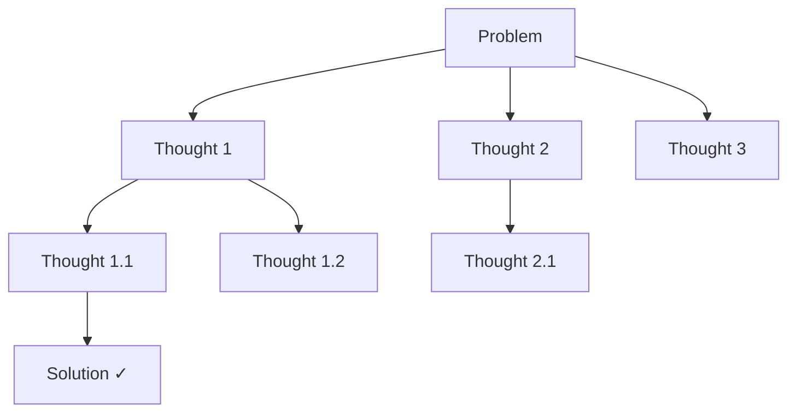

# 🧠 Prompt Engineering Toolkit

[](https://www.python.org/downloads/)
[](https://opensource.org/licenses/MIT)
[](https://langchain.com/)

**Production-ready implementations of advanced prompt engineering techniques** including Chain-of-Thought, Tree-of-Thoughts, ReAct, and more. Move beyond basic prompting with battle-tested patterns from research papers.

---

## 🌟 Features

- **Chain-of-Thought (CoT)** - Step-by-step reasoning for complex problems
- **Tree-of-Thoughts (ToT)** - Explore multiple reasoning paths with BFS/DFS
- **ReAct** - Reasoning + Acting with external tool integration
- **PAL** - Program-Aided Language for mathematical reasoning
- **Self-Consistency** - Multi-path voting for improved accuracy
- **Graph-of-Thoughts** - Advanced reasoning graph structures

---

## 🏗️ Architecture

```
┌─────────────────────────────────────────────────────────────────┐
│                    Prompt Engineering Toolkit                    │
├─────────────────────────────────────────────────────────────────┤
│                                                                  │
│  ┌─────────────┐  ┌─────────────┐  ┌─────────────┐             │
│  │   Chain of  │  │   Tree of   │  │   ReAct     │             │
│  │   Thought   │  │   Thoughts  │  │   Agent     │             │
│  └─────────────┘  └─────────────┘  └─────────────┘             │
│                                                                  │
│  ┌─────────────┐  ┌─────────────┐  ┌─────────────┐             │
│  │    PAL      │  │    Self-    │  │   Graph of  │             │
│  │   Agent     │  │ Consistency │  │   Thoughts  │             │
│  └─────────────┘  └─────────────┘  └─────────────┘             │
│                                                                  │
│                    ↓ All inherit from ↓                         │
│              ┌─────────────────────────┐                        │
│              │    BasePromptAgent      │                        │
│              │  • LLM Integration      │                        │
│              │  • Response Parsing     │                        │
│              │  • Error Handling       │                        │
│              └─────────────────────────┘                        │
└─────────────────────────────────────────────────────────────────┘
```

---

## 🚀 Quick Start

### Installation

```bash
git clone https://github.com/yourusername/prompt-engineering-toolkit.git
cd prompt-engineering-toolkit
pip install -r requirements.txt
```

### Basic Usage

```python
from prompt_engineering import ChainOfThoughtAgent

# Initialize with your LLM
agent = ChainOfThoughtAgent(llm_client=your_llm)

# Solve complex problems with step-by-step reasoning
result = agent.solve(
    problem="If a train travels 120 miles in 2 hours, and then 180 miles in 3 hours, what is its average speed for the entire journey?",
    mode="zero_shot"  # or "few_shot"
)

print(result.reasoning_steps)
print(result.final_answer)
```

---

## 📚 Techniques Explained

### 1. Chain-of-Thought (CoT)

**What it does**: Breaks down complex problems into intermediate reasoning steps.

```python
from prompt_engineering import ChainOfThoughtAgent

agent = ChainOfThoughtAgent(llm_client=llm)

# Zero-Shot CoT (just add "Let's think step by step")
result = agent.solve(problem, mode="zero_shot")

# Few-Shot CoT (with examples)
result = agent.solve(problem, mode="few_shot", examples=examples)

# Self-Consistency (multiple paths, vote on answer)
result = agent.solve_with_consistency(problem, num_paths=5)
```

**When to use**: Math problems, logical reasoning, multi-step tasks.

---

### 2. Tree-of-Thoughts (ToT)

**What it does**: Explores multiple reasoning branches and backtracks when needed.



```python
from prompt_engineering import TreeOfThoughtsAgent

agent = TreeOfThoughtsAgent(
    llm_client=llm,
    search_strategy="bfs",  # or "dfs"
    max_depth=3,
    branching_factor=3
)

result = agent.solve(
    problem="Solve the 24 game: make 24 using [4, 7, 8, 8]",
    evaluation_criteria="mathematical correctness"
)

print(result.solution_path)  # The winning branch
print(result.explored_nodes)  # All nodes explored
```

**When to use**: Puzzles, planning, creative tasks, game-playing.

---

### 3. ReAct (Reasoning + Acting)

**What it does**: Interleaves reasoning with external tool calls.

```
Thought: I need to find the current population of Tokyo
Action: search("Tokyo population 2024")
Observation: Tokyo has approximately 13.96 million people
Thought: Now I need to compare with New York...
Action: search("New York population 2024")
Observation: New York has approximately 8.3 million people
Thought: I can now answer the question
Answer: Tokyo has about 5.66 million more people than New York
```

```python
from prompt_engineering import ReActAgent

# Define your tools
tools = {
    "search": lambda q: web_search(q),
    "calculate": lambda expr: eval(expr),
    "lookup": lambda key: database.get(key)
}

agent = ReActAgent(llm_client=llm, tools=tools)

result = agent.run(
    task="What is the GDP per capita of the country with the tallest building?",
    max_iterations=10
)
```

**When to use**: Tasks requiring external information, multi-step research, fact-checking.

---

### 4. PAL (Program-Aided Language)

**What it does**: Generates code to solve problems, then executes it.

```python
from prompt_engineering import PALAgent

agent = PALAgent(llm_client=llm)

result = agent.solve(
    problem="Roger has 5 tennis balls. He buys 2 more cans of 3. How many does he have?",
    language="python"
)

# Generated code:
# tennis_balls = 5
# cans = 2
# balls_per_can = 3
# total = tennis_balls + (cans * balls_per_can)
# answer = total  # 11

print(result.code)
print(result.answer)  # 11
```

**When to use**: Mathematical problems, data processing, any task where code is more reliable than text reasoning.

---

### 5. Self-Consistency

**What it does**: Generates multiple reasoning paths and votes on the most common answer.

```python
from prompt_engineering import SelfConsistencyAgent

agent = SelfConsistencyAgent(llm_client=llm, num_samples=5)

result = agent.solve(problem)

print(result.answers)  # ["42", "42", "41", "42", "42"]
print(result.final_answer)  # "42" (majority vote)
print(result.confidence)  # 0.8 (4/5 agreement)
```

**When to use**: When you need higher confidence, tasks with deterministic answers.

---

## 📁 Project Structure

```
prompt-engineering-toolkit/
├── prompt_engineering/
│   ├── __init__.py
│   ├── base_agent.py           # Base class for all agents
│   ├── chain_of_thought.py     # CoT implementation
│   ├── tree_of_thoughts.py     # ToT with BFS/DFS
│   ├── react_agent.py          # ReAct pattern
│   ├── pal_agent.py            # Program-Aided Language
│   ├── self_consistency.py     # Multi-path voting
│   └── graph_of_thoughts.py    # Advanced graph reasoning
├── examples/
│   ├── math_reasoning.py
│   ├── puzzle_solving.py
│   └── research_assistant.py
├── tests/
├── requirements.txt
└── README.md
```

---

## 🔧 Configuration

### Environment Variables

```bash
# LLM Provider (optional - can also pass directly)
OPENAI_API_KEY=sk-...
ANTHROPIC_API_KEY=sk-ant-...
GEMINI_API_KEY=...

# Logging
LOG_LEVEL=INFO
```

### Custom LLM Integration

```python
from prompt_engineering import ChainOfThoughtAgent

# Works with any LLM that has a generate() method
class MyLLM:
    def generate(self, prompt: str) -> str:
        # Your LLM call here
        return response

agent = ChainOfThoughtAgent(llm_client=MyLLM())
```

---

## 📊 Comparison: When to Use What

| Technique | Best For | Complexity | Accuracy Gain |
|-----------|----------|------------|---------------|
| **Zero-Shot CoT** | Quick improvements | Low | +10-15% |
| **Few-Shot CoT** | Domain-specific tasks | Medium | +20-30% |
| **Self-Consistency** | High-stakes decisions | Medium | +5-10% |
| **Tree-of-Thoughts** | Complex puzzles | High | +30-40% |
| **ReAct** | Tasks needing tools | High | Variable |
| **PAL** | Math/code problems | Medium | +40-50% |

---

## 📖 References

- [Chain-of-Thought Prompting](https://arxiv.org/abs/2201.11903) - Wei et al., 2022
- [Tree of Thoughts](https://arxiv.org/abs/2305.10601) - Yao et al., 2023
- [ReAct: Synergizing Reasoning and Acting](https://arxiv.org/abs/2210.03629) - Yao et al., 2022
- [PAL: Program-aided Language Models](https://arxiv.org/abs/2211.10435) - Gao et al., 2022
- [Self-Consistency Improves CoT](https://arxiv.org/abs/2203.11171) - Wang et al., 2022

---

## 🤝 Contributing

Contributions welcome! Please read our contributing guidelines.

---

## 📄 License

MIT License - See [LICENSE](LICENSE) for details.

---

## 📬 Contact

**Ravi Teja K** - AI/ML Engineer

- GitHub: [@TEJA4704](https://github.com/TEJA4704)
- LinkedIn: [Connect with me](https://linkedin.com/in/yourprofile)
